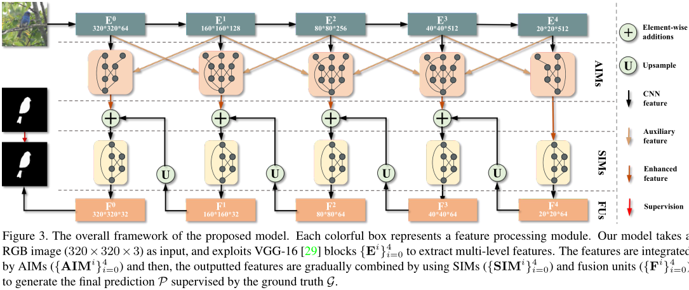
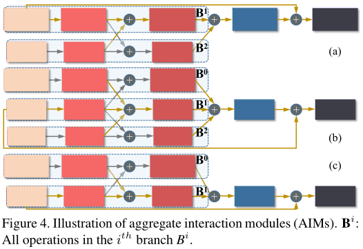
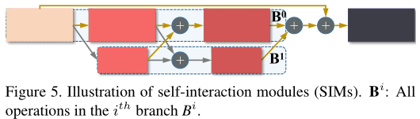
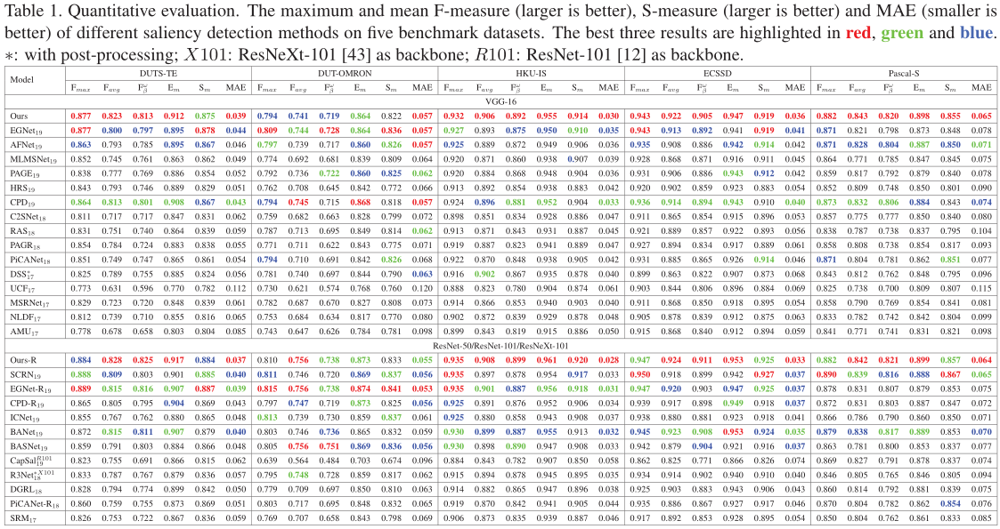
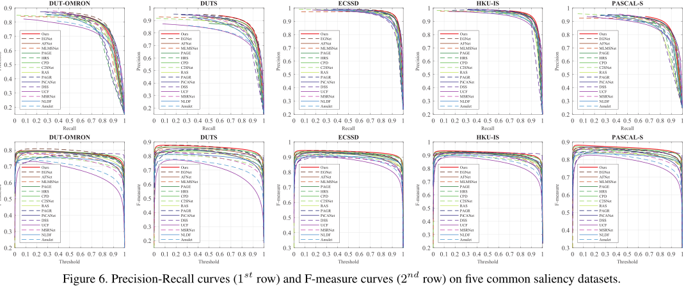
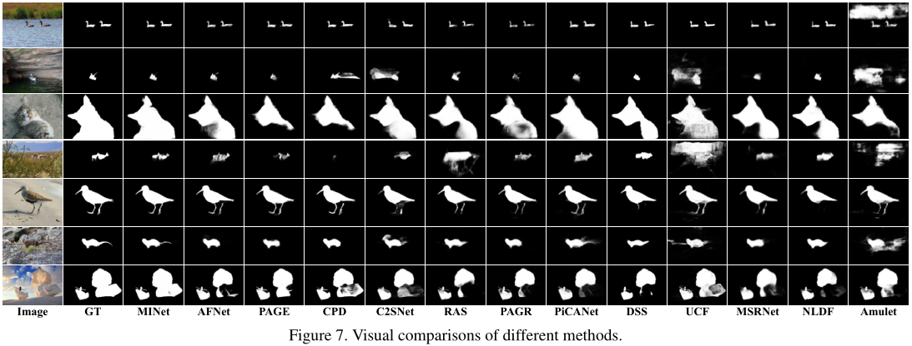

# Multi-scale Interactive Network for Salient Object Detection

[](https://opensource.org/licenses/MIT)


[](https://openaccess.thecvf.com/content_CVPR_2020/html/Pang_Multi-Scale_Interactive_Network_for_Salient_Object_Detection_CVPR_2020_paper.html)
[](https://arxiv.org/abs/2007.09062)

CVPR 2020. 

**NONE**: For subsequent updates of the paper, please see the arixv version.

## Changelog

The code and experimental results have be released now :smile:.

* 2020/7/16:
    * Fix the mistake pointed out by @sjf18 in our code for testing FPS, which will be corrected in the later version of the paper.
* 2020/7/14:
    * The actual interpolation method is pointed out. 
    * Modify the mode of `F.interpolate` in SIM from `scale_factor` to `size`.
* 2020/6/21: Some useful modifications.
    * I optimized the testing process. For details, you can see `code/readme.md`.
    * Added some backbone models using `ws+gn` which can further improve the generalization performance of the model. If there is a need, I can provide the pretrained parameter file of the corresponding improved version of MINet. :)
    * The directory structure has been adjusted.
* 2020/5/10: Some meaningful changes.
    * Some methods have been tried to improve the performance of the model on specific operating environments and devices. The specific experimental results can be found in the section "More Experiments" of `./code/readme.md`.
    * Use black as the repository formatting tool, and set the configuration file `./code/pyproject.toml`.
* 2020/5/6: Add some new attempts and improvements.
    * Modified the method of importing model from the directly setting in config.py, and change it to the automatic selection and instantiation of the specific model class according to the model alias (`exp_name` in config.py).
    * Added a lighter setting for AIM and MInet.
    * Added an attempt to `checkpoint` features of PyTorch.
    * Added learning rate decay strategy with learning rate warm-up. However, the parameter setting is not flexible at present, and needs to be improved.
    * A new optimization strategy has been added to imitate the settings from F3Net.
    * Upload the MIT LICENSE file.
* 2020/4/16: Modify some misleading descriptions in the `readme.md` file.
* 2020/4/7: Simplify the structure of the repository.
* 2020/3/29: Update the method of evaluating results. (See the [`readme.md`](./code/readme.md#Evaluation) for more details.)
* 2020/3/28: Update our code, results, pretrained parameters and some documents.

## Repository Details

* `code`: Complete training and testing code about our method. The `readme.md` file describes how to use the code.
* `docs`: Github page about out paper. Here are some paper details.

## Related Links

* Paper:
    - Baidu Pan: <https://pan.baidu.com/s/1zN7m4aeDhRvTOeF2naATRg> (baidu: 48au)
    - Google Drive: <https://drive.google.com/file/d/1gUYu0hO_8Xc5jgpzetuOVFDrqeSOiKZN/view?usp=sharing>
* Results & Pretrained Parameters:
    - <https://drive.google.com/drive/folders/16yTcf_m-ehnhWgXlN6hbZpBKMy6lYIQQ?usp=sharing>

## Paper Details

### Abstract

> Deep-learning based salient object detection methods achieve great progress. However, the variable scale and unknown category of salient objects are great challenges all the time. These are closely related to the utilization of multi-level and multi-scale features. In this paper, we propose the aggregate interaction modules to integrate the features from adjacent levels, in which less noise is introduced because of only using small up-/down-sampling rates. To obtain more efficient multi-scale features from the integrated features, the self-interaction modules are embedded in each decoder unit. Besides, the class imbalance issue caused by the scale variation weakens the effect of the binary cross entropy loss and results in the spatial inconsistency of the predictions. Therefore, we exploit the consistency-enhanced loss to highlight the fore-/back-ground difference and preserve the intra-class consistency. Experimental results on five benchmark datasets demonstrate that the proposed method without any post-processing performs favorably against 23 state-of-the-art approaches. The source code will be publicly available at https://github.com/lartpang/MINet.

### Architecture







### Comparison







## BibTeX

```text
@inproceedings{MINet-CVPR2020,
    author = {Pang, Youwei and Zhao, Xiaoqi and Zhang, Lihe and Lu, Huchuan},
    title = {Multi-Scale Interactive Network for Salient Object Detection},
    booktitle = CVPR,
    month = {June},
    year = {2020}
}
```
